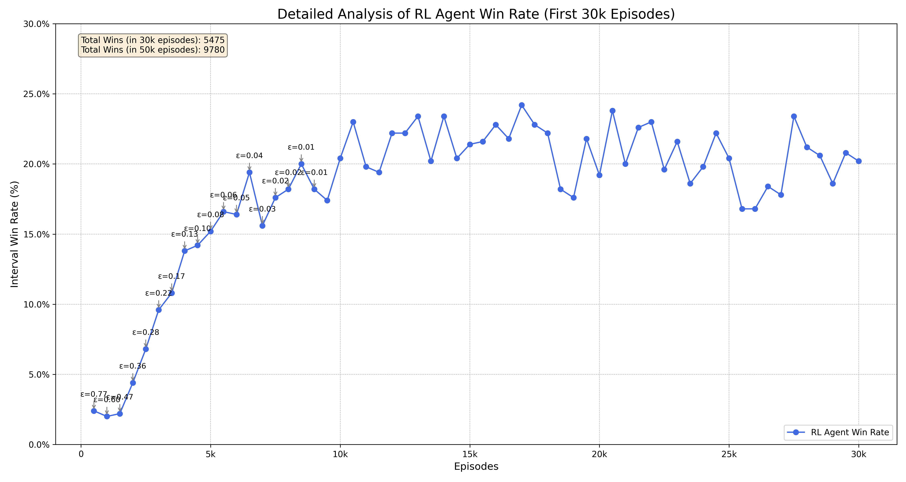

# Cheat RL Agent


A project focused on developing a Reinforcement Learning agent capable of mastering the card game "Cheat" (also known as "I Doubt It" or "Bluff"). The ultimate goal is to research and train an agent that can play at a superhuman level.

The entire game environment was built from scratch in Python to provide full control over the rules, state representation, and reward mechanisms for training and experimentation.

---

## 📖 Game Rules

The specific rules implemented in this environment are detailed in a separate file. For a complete understanding of the game logic, please refer to [**RULES.md**](RULES.md).

---

## 🛠️ Built With

This project leverages the following technologies and libraries:

* **Python 3:** The core programming language.
* **PyTorch:** The primary deep learning framework for the neural networks.
* **NumPy:** For efficient numerical operations, especially in state representation.
* **Pandas & Matplotlib:** Used for analyzing and plotting the training results.

---

## 🚀 Getting Started

Follow these steps to set up the project locally.

### Prerequisites

* Python 3.9 or higher.
* `pip` and `venv` modules (usually included with Python).

### Installation

1.  **Clone the repository:**
    ```sh
    git clone [https://github.com/your_username/Cheat-RL-Project.git](https://github.com/lboclin/Cheat_RL_Project.git)
    ```

2.  **Navigate to the project directory:**
    ```sh
    cd Cheat-RL-Project
    ```

3.  **Create a virtual environment:**
    ```sh
    # On macOS/Linux
    python3 -m venv venv

    # On Windows
    python -m venv venv
    ```

4.  **Activate the virtual environment:**
    ```sh
    # On macOS/Linux
    source venv/bin/activate

    # On Windows (PowerShell)
    .\venv\Scripts\activate
    ```

5.  **Install the required dependencies:**
    ```sh
    pip install -r requirements.txt
    ```

---

## 📈 Usage

Once the setup is complete, you can run the main scripts from the root of the project directory.

* **To start the training process:**
    ```sh
    python main.py
    ```
    Training progress (model checkpoints) is saved to `training_checkpoint.pth`, and performance metrics are logged in `win_rate_log.csv`.

* **To plot the training results:**
    ```sh
    python plot_results.py
    ```
    This will generate a `win_rate_evolution.png` file and display the chart.

---

## 📊 Preliminary Results

This experimental phase aimed to establish a performance baseline for a Deep Q-Network (DQN) agent in the game of "Cheat". The agent was developed with a "blind" architecture, wherein the neural network head responsible for strategic card selection was disabled. This ablation study forces the agent to learn the game's core mechanics—when to challenge, pass, or play, and what rank/quantity to announce—without the ability to choose which specific cards to use in a bluff. The agent was trained against a pool of four distinct rule-based opponents over 50,000 episodes. To analyze the impact of the exploration-exploitation trade-off, the `epsilon_decay` hyperparameter was varied across three primary training regimes. The results demonstrate that a prolonged exploration phase is critical for this problem, with the best-performing agent achieving a peak win rate of **25.8%**.



---

## 🗺️ Roadmap

The current research plan is structured as follows:

-   [x] Establish a performance baseline using a DQN agent with the `rank_selection` head disabled (a "blind" agent).
-   [x] Enable and train the fourth network head (`rank_selection`) to allow for strategic bluffing.
-   [ ] Implement and train a PPO (Proximal Policy Optimization) agent.
-   [ ] Conduct a comparative analysis of the performance between the DQN and PPO agents.

See the `RESEARCH_LOG.md` for detailed notes on each experimental phase.