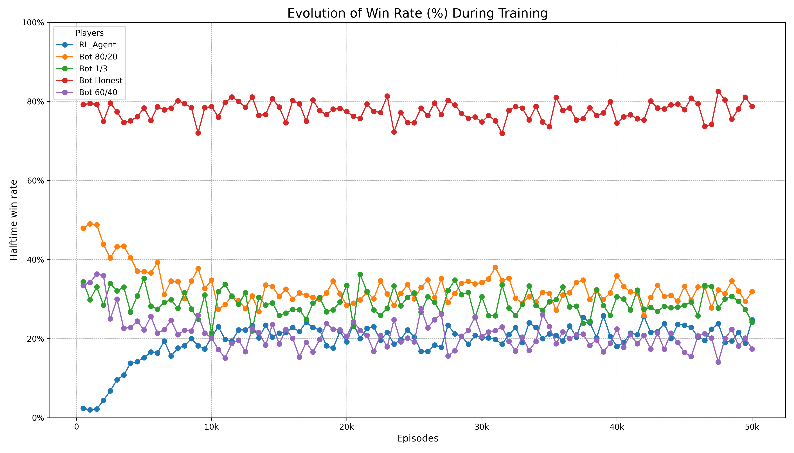

# Cheat RL Agent


This project is dedicated to the development of a Reinforcement Learning (RL) agent capable of mastering the card game "Cheat" (also known as "Bluff" or "I Doubt It"). The ultimate objective of this research is to train a model that achieves **superhuman proficiency**, outperforming the decision-making and bluffing strategies of even highly experienced human players.

To reach this level of mastery, the project follows a rigorous experimental methodology. It begins with an exhaustive comparison of different architectures—**Deep Q-Network (DQN)** and **Proximal Policy Optimization (PPO)**—evaluated against a pool of rule-based bots that simulate various human playing styles. Following this comparative analysis, the superior algorithm is selected for a **Self-Play** curriculum, where the agent evolves its strategies by competing against increasingly advanced versions of itself.

The entire game environment was built from scratch in Python to provide absolute control over the rules, state representation, and reward mechanisms, ensuring a robust framework for scientific experimentation.

---

## 📖 Game Rules

The game logic adheres to the standard "Cheat" mechanics, including complex interactions such as initiating rounds, doubting bluffs, and strategic passing. For a comprehensive breakdown of the implemented logic, please refer to [**RULES.md**](RULES.md).

---

## 🛠️ Built With

* **Python 3.9+**: The core language for environment and agent logic.
* **PyTorch**: The primary framework for implementing deep neural networks (Multi-Head Actor-Critic).
* **NumPy**: Used for efficient numerical operations and state vector representations.
* **Pandas & Matplotlib**: Employed for data analysis and visualization of training metrics.

---

## 🚀 Getting Started

Follow these steps to set up the environment and begin experimentation.

### Installation

1.  **Clone the repository:**
    ```sh
    git clone [https://github.com/lboclin/Cheat_RL_Project.git](https://github.com/lboclin/Cheat_RL_Project.git)
    ```

2.  **Navigate to the directory and set up a virtual environment:**
    ```sh
    cd Cheat-RL-Project
    python -m venv venv
    # On Windows:
    .\venv\Scripts\activate
    # On macOS/Linux:
    source venv/bin/activate
    ```

3.  **Install dependencies:**
    ```sh
    pip install -r requirements.txt
    ```

---

## 📊 Methodology & Research Findings

### Algorithmic Benchmarking: DQN vs. PPO
A core phase of this research involved a head-to-head comparison between DQN and PPO to determine which architecture better navigates the high-dimensional action space of "Cheat".

* **Performance Metrics**: PPO demonstrated a staggering improvement in sample efficiency, training approximately **20x faster** than DQN in standardized scenarios.
* **Convergence**: PPO successfully achieved a **100% win rate** against honest bot strategies within 35,000 timesteps—a milestone the DQN agent failed to consolidate consistently.
* **The Challenger Paradox**: Interestingly, experiments against the aggressive "Challenger Bot" revealed that while PPO is faster, its Multi-Head architecture is highly sensitive to extreme punishment. DQN showed higher resilience in specific deterministic scenarios, leading to the decision to refine PPO through Self-Play to overcome these local optima.

### Baseline Training (DQN Blind)
Initial experiments utilized a "blind" DQN agent (with the strategic card-selection head disabled). This ablation study established a baseline win rate of **25.8%**, proving the agent could learn the core mechanics—doubting and passing—even before mastering the art of the sophisticated bluff.



---

## 🗺️ Research Roadmap

The project is structured into six progressive phases:

- [x] **Phase 1**: Establish a performance baseline using a DQN agent with the `rank_selection` head disabled (a "blind" agent).
- [x] **Phase 2**: Enable and train the fourth network head (`rank_selection`) to allow for strategic bluffing.
- [x] **Phase 3**: Implement and train a PPO (Proximal Policy Optimization) agent using a Multi-Head Actor-Critic architecture.
- [x] **Phase 4**: Conduct a comparative analysis of the performance between DQN and PPO agents across stochastic and deterministic environments.
- [ ] **Phase 5**: Implement an interface for humans to play against the AI models.
- [ ] **Phase 6**: Implement **Self-Play** using the PPO algorithm to evolve strategies beyond the limitations of fixed rule-based bots.
- [ ] **Phase 7**: Conduct final **Human vs. AI testing** to verify if the Self-Play agent has achieved superhuman mastery of the game.

For detailed logs and technical deep-dives into each phase, see [**RESEARCH_LOG.md**](RESEARCH_LOG.md).